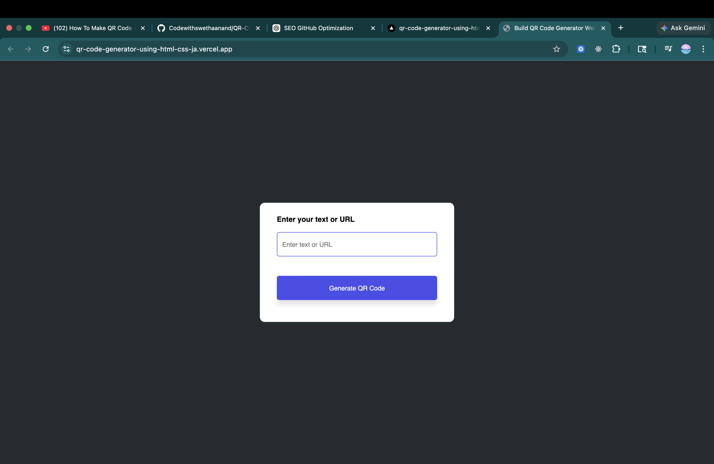

<h1 align="center">Frontend Developer | SEO Specialist</h1>

  

QR Code Generator Project
Live Demo:
https://qr-code-generator-using-html-css-ja.vercel.app/

Project Preview

About Project
This is a simple and interactive QR Code Generator built using:
- HTML
- CSS
- JavaScript

Features:
- Generate QR instantly
- Clean UI
- Mobile responsive

 GitHub Repo
https://github.com/Codewithswethaanand/QR-Code-Generator-using-HTML-CSS-JavaScript

Connect with me
- LinkedIn: https://www.linkedin.com/in/swetha-seoanalyst/
